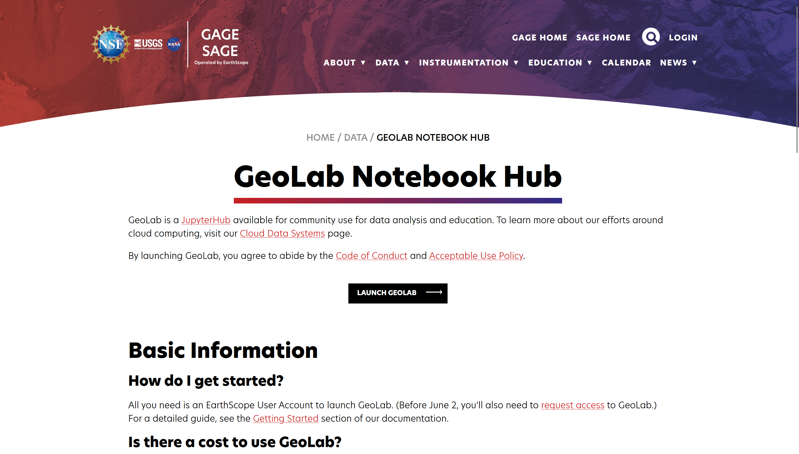
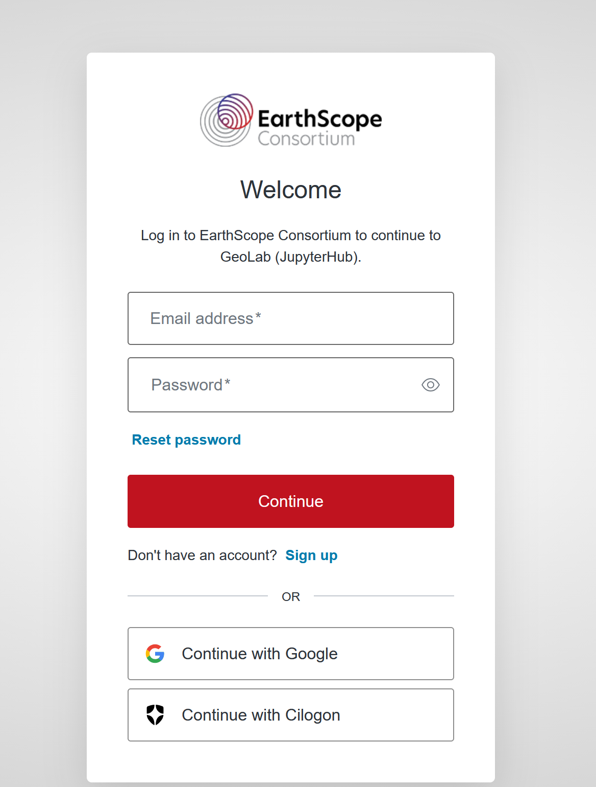
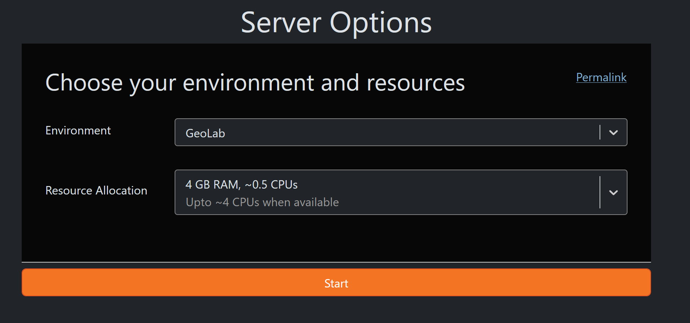
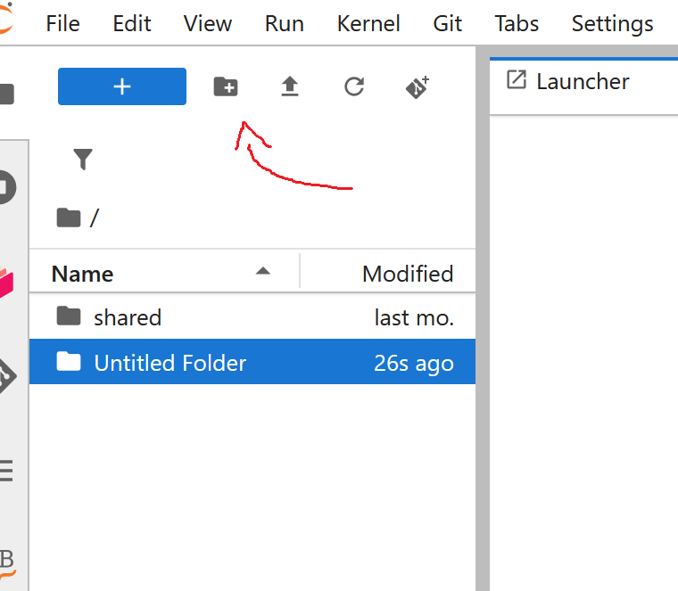

# How to Log into EarthScope GeoLab

GeoLab is EarthScope's cloud JupyterLab environment, allowing you to process massive amounts of seismic data directly on the cloud without incurring download times or egress fees.

### Step 1: Navigate to the GeoLab Portal
Go to the official EarthScope GeoLab homepage: [https://www.earthscope.org/data/geolab/](https://www.earthscope.org/data/geolab/) and click on the **Login** button.


*(Save your screenshot as `geolab_login.png` in the `images` folder)*

### Step 2: Authenticate 
Authenticate by entering your credentials into the following screen



### Step 3: Start a Server
Once authenticated, start a new JupyterLab server session. By selecting the desired server options given on screen.



### Step 4: Making new folder for project
Now that we are inside geolab you can press the following icon in order to make a folder for your project 


### Step 5: Upload the Notebook
Upload the `Cloud_Download_Code.ipynb` file from your local machine into your newly created GeoLab folder. Double-click the notebook to open it.

### Step 6: Install Required Packages
The first code cell contains pip install commands. Run this cell to ensure critical packages are installed in your GeoLab environment:

```python
!pip install earthscope-cli
!pip install boto3
!pip install earthscope-sdk
!pip install obspy
```

### Step 7: Authenticate the SDK (`es login`)
Run the cell containing the `!es login` command. This will generate an authentication link. Click the link, authorize your device, and return to the notebook once it says "Successful login".

```python
!es login
```

### Step 8: Initialize Secure AWS Connection
Run the subsequent cells to securely grab your temporary AWS tokens and initialize the `boto3` client to connect directly to the massive EarthScope `miniseed/` S3 bucket.

```python
from earthscope_sdk import EarthScopeClient
import boto3
from botocore.config import Config

client = EarthScopeClient()
creds = client.user.get_aws_credentials()

session = boto3.Session(
    aws_access_key_id=creds.aws_access_key_id,
    aws_secret_access_key=creds.aws_secret_access_key,
    aws_session_token=creds.aws_session_token,
)

s3_client = session.client("s3", config=Config(response_checksum_validation='when_required'))
```

### Step 9: Download the Data
The final cells of the notebook demonstrate how to stream the exact `.mseed` files you need directly into your GeoLab workspace using `s3_client.get_object()`. Because you are running this inside GeoLab, the download speeds are incredibly fast and completely bypass local network bottlenecks!

```python
S3_ACCESS_POINT = "earthscope-mseed-res-na3mtd4fq5kz7pntcyr1uh46use2a--ol-s3"
PREFIX = "miniseed/"

get_resp = s3_client.get_object(
    Bucket=S3_ACCESS_POINT,
    Key=f"{PREFIX}UW/2024/300/SLA.UW.2024.300#2"
)
```
