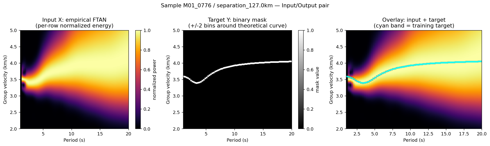
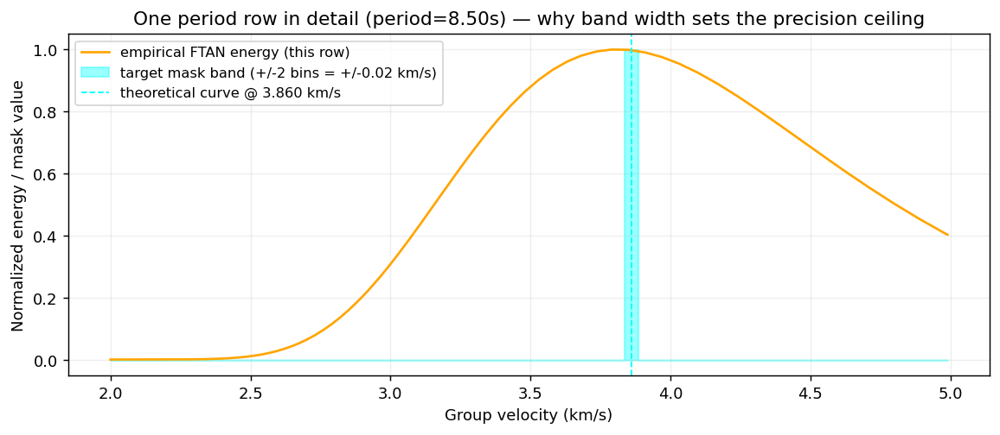

# Design Rationale: Why the FTAN Mask-Segmentation Approach Works (and Where It Might Not)

**What this document is for**: a prerequisite conceptual primer on the ML pipeline's
design — what problem it's solving, why it's framed as image segmentation rather than
direct regression, what the input/output structure actually is, and what its built-in
limitations are. This is deliberately separate from the stage docs
(`stage_a_data_definition.md`, `stage_b_model_definition.md`), which are experiment
logs (hypothesis/results/decision), not conceptual teaching material. Read this first;
read the stage docs for what was actually tested and found.

References: `src/wavenet_pipeline/03_machine_learning/{ftan_grid,dataset,model}.py`,
`docs/ml_pipeline_stages/{stage_a_data_definition,stage_b_model_definition}.md`,
`CLAUDE.md`, `docs/HANDOFF.md`.

---

## 1. The problem being solved

Given an FTAN image — a 2D energy surface over (period, group velocity) computed from
an ambient-noise cross-correlation via continuous wavelet transform — extract a 1D
curve: for each period, what is the group velocity of the fundamental-mode surface
wave. This is a **ridge-tracing problem**: find the thin path of concentrated energy
running through a noisy 2D map.



*Figure 1 — a real sample (M01_0776, sep=127km) from the tutorial dataset. Left: the
empirical FTAN image the network sees as input (per-row normalized). Middle: the
binary mask it's trained to output, built from the theoretical (known-correct)
dispersion curve. Right: the two overlaid — note the true curve sits along an
**inflection/edge** of the bright region, not necessarily at the single brightest
pixel per row. A naive "pick the maximum" heuristic would get this wrong in places;
the network has to learn a slightly more nuanced signal than raw peak-picking.*

## 2. Why segmentation, not direct regression

Two ways to frame this for a neural net:

- **Direct regression**: input the FTAN image, output 76 real numbers (one velocity
  per period bin).
- **Segmentation** (what this pipeline does): input the FTAN image, output a
  same-shaped binary mask marking "which pixels are on the curve."

A U-Net is fundamentally a **dense pixel classifier** — its whole architecture
(downsample for context via `DoubleConv`/`MaxPool2d`, upsample with skip connections
for precise spatial localization via `ConvTranspose2d`) is built for "label every
pixel," not "compress an image into a handful of scalars." Forcing it into direct
regression (encoder + a fully-connected head emitting 76 floats) throws away exactly
the spatial-precision machinery U-Net is good at, and gives the network a much less
constrained optimization target — it would have to learn to compress 2D spatial
structure into precise real numbers with no intermediate spatial supervision.
Segmentation instead gives **per-pixel ground truth everywhere in the image**, a far
denser and more stable training signal, and lets the eventual curve be recovered by a
simple, well-understood post-processing step (see §5) rather than trusted directly
from the network's output.

## 3. Input / output structure, concretely

| | Shape | Contents |
|---|---|---|
| **Input `X`** | `(1, 80, 300)` | Rows 0-75: empirical FTAN, regridded to period 1-20s (76 bins) x velocity 2-5 km/s (300 bins), **per-row max-normalized**. Rows 76-79: zero-padding (not data) so 4 U-Net pooling steps (80->40->20->10->5) land on clean integers. |
| **Target `Y`** | `(1, 80, 300)` | Strictly binary `{0,1}`. Built from the theoretical (CPS-exact) dispersion curve — for each of 76 period rows, a band of `MASK_WIDTH=2` bins (5 total) around the true velocity is marked `1`, everything else `0`. Rows 76-79 always `0`, matching the input padding. |
| **Model output** | `(1, 80, 300)` | Raw logits (sigmoid externally) — a per-pixel probability-of-being-on-the-curve heatmap, same shape as the target. |

Per-row normalization on the input matters: raw CWT power varies hugely in absolute
magnitude across periods and models, but what actually locates the curve is *where the
peak sits relative to the rest of that row*, not its absolute brightness. Normalizing
per-row throws away amplitude noise and keeps the shape that matters.

**The model's probability map is not yet the scientific answer.** A separate
post-processing step (`ftan_grid.weighted_centroid_curve`) converts it back into an
actual continuous `(period, velocity)` curve. The real pipeline is:

```
FTAN image  --[U-Net]-->  probability heatmap  --[weighted centroid per row]-->  curve
```

## 4. Why a *band*, not a single-pixel line — and why this sets a hard precision ceiling



*Figure 2 — a single period row (8.5s) from the same sample, in detail. The orange
curve is the smooth, broad empirical energy distribution across all 300 velocity bins.
The cyan band is the training target — a 5-bin-wide slice around the true velocity. The
network must learn to extract this narrow, precise target from a signal that (as this
plot shows) can be broad and smoothly peaked over a wide range, not sharply spiked.*

Two competing pressures on the mask width:

- **Too thin** (e.g., 1 exact pixel per row): a delta function — 1 positive pixel out
  of 300, a brutal class-imbalance problem, brittle to the smallest interpolation
  rounding error. The network would need pixel-perfect confidence to get any credit,
  an unreasonably hard target against noisy input.
- **Too wide**: the network can "win" by being vaguely right over a big region, and the
  eventual extracted curve becomes imprecise.

`MASK_WIDTH=2` (5 bins total) is the chosen middle ground, and it directly sets the
**ceiling on how precise this whole approach can ever be**: 5 bins over a 3 km/s range
across 300 bins is ~0.01 km/s/bin, so the design's best-case resolution is about
**+-0.02 km/s**, regardless of how well the network trains. This is exactly the number
behind Stage A's QA-gate threshold discussion (0.05 -> 0.08-0.10 km/s) — that threshold
only makes sense *relative to* this floor. If tighter output precision is ever needed,
the mask width itself is what to revisit, not the network architecture or training
schedule.

## 5. Value in the training pipeline

- Converts a historically manual/heuristic task (visually picking the ridge on an FTAN
  plot, or a brittle "argmax per row" script) into a well-posed, well-studied ML
  formulation (binary image segmentation) with mature architectures and losses built
  for exactly this.
- The physics-based ground truth (CPS's exact modal solution, known only because this
  is synthetic data) supervises every pixel, not just a handful of hand-labeled points
  — this is what makes large-scale synthetic training data valuable at all.
- The eventual payoff is a model that generalizes to **real** ambient-noise data, where
  there is no ground-truth curve to check against — replacing manual picking with a
  learned, hopefully-noise-robust extractor. That transfer has not been tested yet (see
  §6).

## 6. Where this might not work — real, specific risks

- **Severe class imbalance is load-bearing, not incidental.** ~1.7% of pixels are
  positive per row (see the `positive_frac=0.0167` invariant discussed in Stage A's
  tier logs). A network minimizing plain pixel-wise BCE can hit ~98% accuracy by
  predicting all-zero and never finding the curve at all. This is why the loss is a
  4-way composite (`FocalLoss` + `DiceLoss` + `WeightedBCELoss` + a `SharpeningLoss`
  term, see `losses.py`), and why **IoU/Dice are the metrics that matter, not raw pixel
  accuracy** — accuracy alone would hide total failure.
- **Aggressive downsampling can erase a thin signal.** The bottleneck compresses the
  300-wide velocity axis to 18 pixels (`model.py`'s 4-level `UNetSeg`). A ridge that's
  only 5/300 wide to begin with is a genuinely thin signal to survive 4 rounds of
  pooling — this is part of why skip connections (not a plain encoder-decoder) matter:
  they're what lets fine localization survive the downsampling path.
- **Blank rows are a real, unresolved edge case.** If a period falls outside the
  theoretical curve's coverage, `np.interp`'s boundary behavior (`left=nan,
  right=nan`) leaves that row with zero positive pixels — no supervision signal for
  that period at all. Whether this is "fine, just unpredictable periods" or a modeling
  gap that affects a meaningful fraction of the 20,000-model dataset is exactly what
  the pending full-dataset validation (not the 20-sample local check) is positioned to
  answer — see `stage_a_data_definition.md`'s open questions.
- **Everything is trained on synthetic data.** The mask/target only exists because the
  underlying 1D Earth model is known. Real field FTAN images have no such answer key.
  Generalization depends entirely on how realistic the simulator's noise-source model
  is (the 1,000,000-point-source, 360-wedge design in `wvsim_main.py` exists
  specifically to make this plausible) — the segmentation approach could work perfectly
  in training and still fail on real data if synthetic FTAN images don't resemble real
  ones closely enough. Nothing built so far (Stage A/B) has tested this; it's a
  question for Stage E and beyond.
- **The precomputed input's correctness is a prerequisite, not a detail.** If the
  stored `FTAN_ZZ` values were themselves systematically wrong (a simulator bug, not a
  segmentation-design flaw), the network would train "successfully" against bad input
  and look fine right up until tested against real data. This is exactly why the QA
  gate (precomputed vs. independently recomputed FTAN, `validate_ftan.py`) is a
  *blocking* check on Stage A, not an optional nice-to-have — it validates the
  foundation this entire design depends on.

## 7. Summary — what to check for when someone explains this pipeline back to you

A correct explanation should independently arrive at, in their own words:
1. Why segmentation beats direct regression here (U-Net is a pixel classifier).
2. What the input and target actually are, and why per-row normalization matters.
3. That the +-2 bin mask width is a deliberate tradeoff that sets a hard +-0.02 km/s
   precision ceiling on the whole approach.
4. That IoU/Dice, not pixel accuracy, are the metrics that actually matter, and why.
5. That a network output is a probability heatmap, not the final curve — a separate
   centroid-extraction step produces the scientific deliverable.
6. That synthetic-to-real generalization is untested and is the biggest open
   scientific risk, not an implementation detail.

If an explanation only covers "I ran the notebook and the numbers matched," none of the
above has actually been demonstrated.
