# XD.MTAN – XD.RUNG BHZ: pipeline smoke test, FastMSPEC benchmark against ADAMA, and verified fixes

*Test of `URseismology/wavenet-epicAI`, branch `add-september-ncf-pipeline`, `00_waveform_acquisition/` — 2026-09-25.
Prepared for the pipeline authors and for an automated reviewer: everything needed to re-check each claim is in this folder (see §9).*

## 1. Summary

**What was done.** Two stations (XD.MTAN, XD.RUNG; 109.5 km apart; 1994-05-25 to 1994-10-30; `channel="BH?"`) were downloaded, preprocessed and packaged with the pipeline, merged with `build_master_h5.py`, read back with
`load_master_h5.py`, and cross-correlated with FastMSPEC. The result was benchmarked against ADAMA's independent Rayleigh-wave phase velocity for the same pair. The whole window was then reprocessed with **patched code** (§5) and the benchmark repeated.

**Verdict.**
1. The chain works end to end, and the correlation of the re-loaded data reproduces ADAMA's phase velocities.
2. The original code has **one defect that matters** — the placement of each processed day on the 1 Hz grid (§4.1–4.2): a systematic 1.0 s timing error between the two stations' analysis windows, and 5 station-days (14 channel-days) silently dropped. Four smaller issues are described in §4.3–4.6.
3. The patched pipeline removes it: **0 days refused** over the full window; the benchmark on the fixed pipeline's *unmodified* output — correlation **+0.83** with ADAMA's predicted coherence, **12/12** zero crossings found, median velocity offset **-0.6 %** — versus **+0.65, 8/12, -2.3 %** for the original pipeline. The original data with a downstream timing correction reaches +0.83 / 12/12 / -0.5 %, i.e. the fix delivers in the pipeline what would otherwise have to be patched downstream.

| variant | days | correlation with ADAMA-predicted coherence | ADAMA zero crossings found | observed crossings that are real | median velocity offset vs ADAMA | 95th percentile of absolute coherence |
|---|---|---|---|---|---|---|
| Original pipeline, as packaged (the smoke test proper) | 156 | +0.65 | 8/12 | 0.67 | -2.3 % | 0.17 |
| Original + downstream timing correction | 153 | +0.83 | 12/12 | 1.00 | -0.5 % | 0.18 |
| **FIXED pipeline, as packaged (no downstream correction)** | 157 | +0.83 | 12/12 | 1.00 | -0.6 % | 0.17 |
| Fixed pipeline, outlier days removed | 122 | +0.88 | 12/12 | 1.00 | -0.7 % | 0.24 |
| Single-taper, original pipeline | all | +0.69 | 10/12 | 0.80 | -1.7 % | 0.19 |
| Single-taper, fixed pipeline | all | +0.87 | 12/12 | 1.00 | -0.2 % | 0.19 |

*How to read the table.* All rows use the same 3-hour windows and FastMspec bandwidth (0.001, NW ≈ 10.8). "ADAMA zero crossings found" counts how many of the 12 zero crossings predicted from ADAMA's curve have an observed crossing within a quarter of the local spacing;
"observed crossings that are real" guards against a noisy curve trivially matching (single-taper: 80 observed crossings for 12 predicted). ADAMA's product for this pair is the *initial* AkiEstimate solution (`co_ral`); no final Rayleigh solution exists.

## 2. What was run

| item | value |
|---|---|
| stations / window / channel | XD.MTAN (−7.9073, 33.3203), XD.RUNG (−6.9372, 33.5180); 1994-05-25 to 1994-10-30; `BH?`; correlation on BHZ |
| where | Bluehive, isolated root `/scratch/tolugboj_lab/wavenet_ncf_xd_pair_test/` (production and canary roots untouched), partition `urseismo`, account `tolugboj_lab`; `instaseis` environment for the pipeline, `fastmspec_batch` for correlation |
| original run | `orchestrator.py` as a patched copy with **only four lines changed** (start/end date, channel list/priority — the tool hard-codes 1970–yesterday and `BH?,LH?`); `build_master_h5.py`, `load_master_h5.py` unmodified |
| fixed run | patched `orchestrator.py` + `build_master_h5.py` (§5), reprocessing the already-downloaded raw files in 5 date-range chunks per station, merged with the patched `build_master_h5.py` |
| correlation | FastMSPEC `compute_crosscorr_mtc_fastmspec`, bandwidth 0.001, 3-hour windows, 50 % overlap, 15 per UTC day |
| benchmark | ADAMA `ADAMAraw_co_ral.h5`, pair `XD.RUNG-XD.MTAN` (ZZ, Rayleigh), 0.028–0.196 Hz (periods 5–35 s), 3.28–3.77 km/s |

## 3. Pipeline results (original code)

| station | download | download volume / time | preprocess | preprocess volume / time | package (.h5) |
|---|---|---|---|---|---|
| XD.MTAN | yes | 477 files, 902 MB, 1 min | yes | 159 days, 2.86 h | yes, 166 MB |
| XD.RUNG | yes | 477 files, 897 MB, 1 min | yes | 159 days, 2.89 h | yes, 183 MB |

**Actual overlapping range.** The nominal window is 159 calendar days (about 5.2 months; XD.MTAN's deployment ends 1994-10-30, XD.RUNG's runs to 1995-05-16, so MTAN limits the overlap). Read back through `load_master_h5.py`, the common range of the original packaging is
**1994-05-25T17:35:52 → 1994-10-30T11:52:27 (157.8 days)**; of 157 full UTC days, **156 were usable** (2340 windows).
For the fixed pipeline: **1994-05-25T17:35:52 → 1994-10-30T11:52:27 (157.8 days)**, **157 usable** of 157 full UTC days (2355 windows).
Merge and load-back worked for both (XD.MTAN 13,630,596 samples, XD.RUNG 13,703,623 at 1.0 Hz; the placement replay in §4.1 predicted 13,630,596 and 13,703,623).

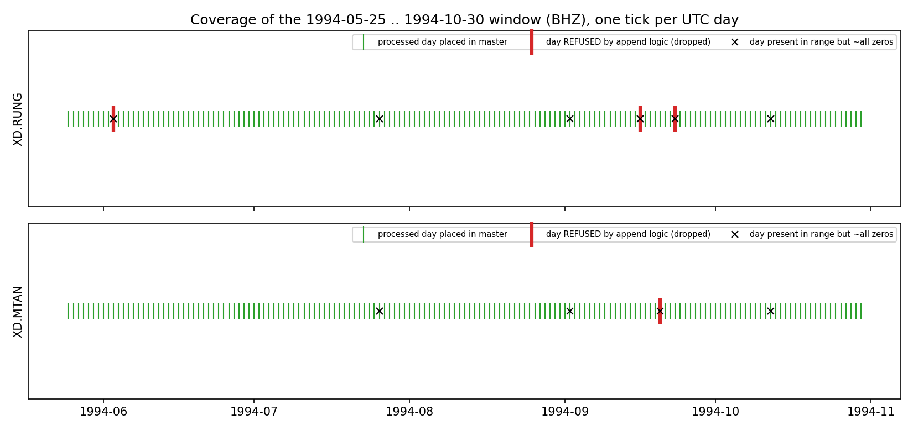
*Figure 1 — Coverage of the window for each station (original pipeline): placed days, refused days, all-zero days.*

## 4. Findings in the original pipeline

### 4.1 Day placement gives a timing error (universal mechanism)
`append_channel_data` appends each processed day right after the previous one on a grid anchored at the station's **first stored sample**, using `max(round(gap) − 1, 0)`. Two facts then determine the error:
the first stored sample begins mid-day at an arbitrary phase; every later day begins ~0.0–0.05 s after midnight. For continuous data the placement error therefore stays **constant at `e = k × 0.05 s`**, where `k` (0…19) is which 20 Hz sample of the second the record started on — the clamp can only *delay* data, never advance it. Observed: XD.RUNG -0.35 … +0.70 s (median +0.68; k = 14),
XD.MTAN -0.03 … +0.22 s (median +0.21; k = 4). After a real gap of ≥ 1.5 s the offset re-randomises (RUNG steps to ≈ −0.32 s after the refused days), so it also jumps by whole seconds.
Relative RUNG − MTAN placement error: -0.54 … +0.51 s (median +0.47). Slicing UTC days from the packaged arrays adds each station's grid-phase offset (-0.30 s at RUNG, +0.22 s at MTAN),
so the two stations' analysis windows are offset by ≈ 0.99 s in true time (range -1.03 … +0.02 s).

**Replay and independent verification.** Replaying the append arithmetic from the raw file headers (`code/timing_replay.py`) reproduces the four positions measured directly against the packaged files exactly, and predicts the final array lengths. Across **310 station-days** (both stations, every UTC day where both records exist and the band coherence exceeds 0.9), the shift measured directly between the original and the fixed data agrees with the replay's prediction to a median of **0.0 ms** (95th percentile 0 ms, maximum 1 ms) — including the one-second steps.

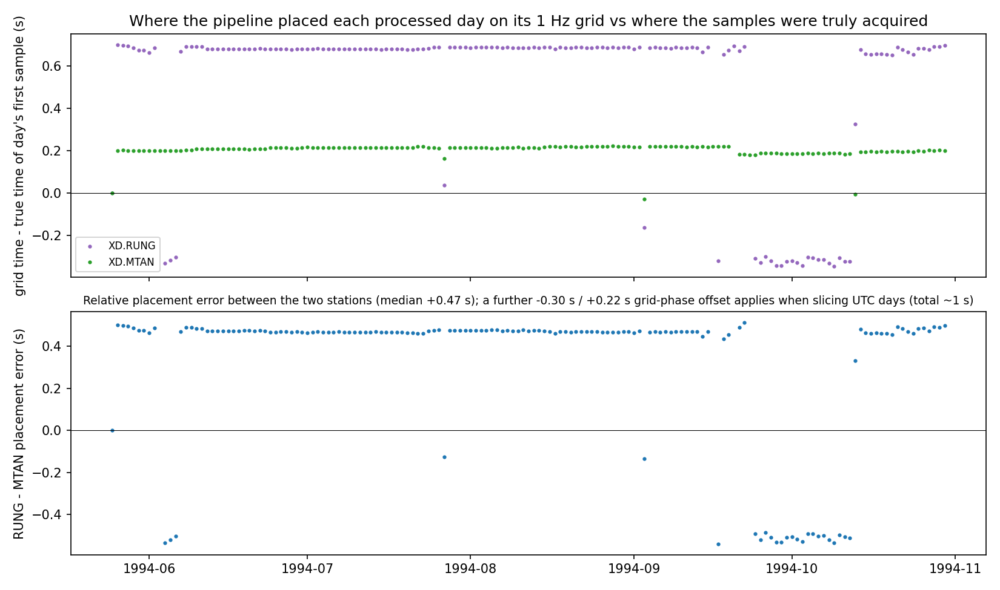
*Figure 2 — Placement error of every processed day (original pipeline), and the relative error between stations.*

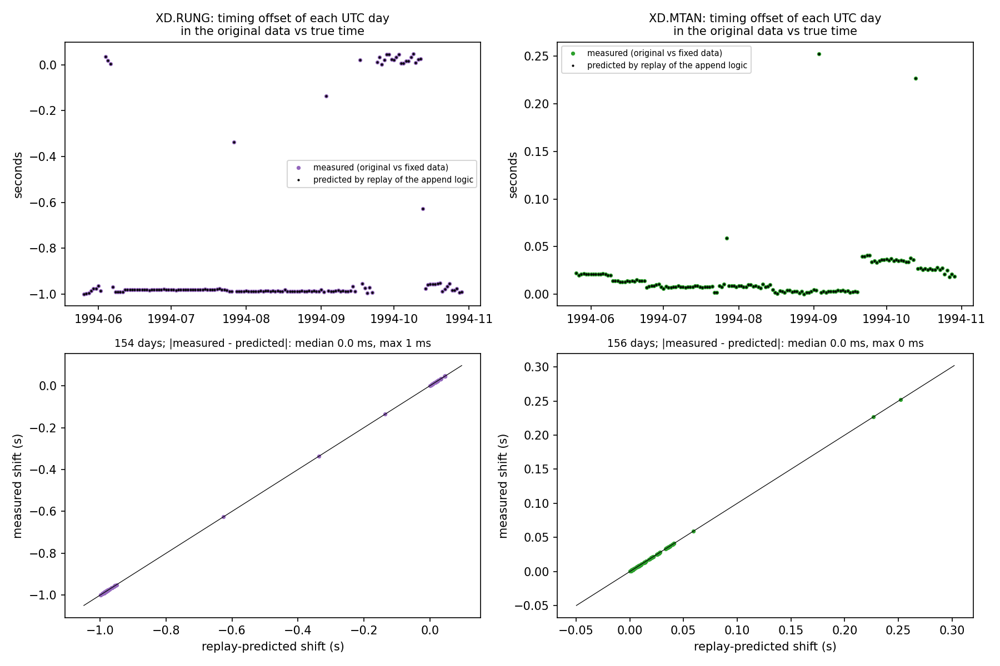
*Figure 3 — Measured (original vs fixed data) versus replay-predicted timing offset, every day.*

### 4.2 Days dropped as "overlap" (universal logic, data-dependent rate)
5 station-days (14 channel-days) lost data to the overlap test: **4 for all three channels** (XD.MTAN 19940920; XD.RUNG 19940603, 19940916, 19940923) and **1 for two of three** (XD.RUNG 19941020: BHE and BHN refused, BHZ kept), i.e. 14 of 954 channel-days. The BHZ correlation therefore lost 4 days; the horizontals (needed for Love waves) lost 5.
In each case the **previous** day's data run past midnight, so the next day's first decimated sample is placed at or before the stored end and the append drops the **entire next day** (for that channel):
* for the four full refusals the merged previous day has 1,728,001 raw samples (normal 1,728,000) and so decimates to 86,401, and the last sample lands on the next day's first slot. For XD.MTAN the extra sample is the day file's inclusive end sample, 0.003 s past midnight; for XD.RUNG the day consists of two record segments separated by a one-sample gap, which the merge fills;
* for RUNG 1994-10-20 the previous day file (BHE and BHN) carries 847 extra raw samples — a record segment that straddles midnight and runs 42 s into the next day, where the next day's file continues. The stored end (00:00:42.701) is later than the next day's first sample (00:00:42.413), so the day is refused. BHZ's previous day also ran 8.0 s past midnight, but at that join the new day began after the stored end and nothing was refused.

| station, refused day | channels refused | previous day | previous-day raw samples after merging record segments (normal 1,728,000) | previous-day decimated samples (normal 86,400) | record segments | previous-day data run past midnight by (s) |
|---|---|---|---|---|---|---|
| XD.MTAN 19940920 | BHE, BHN, BHZ | 19940919 | 1,728,001 | 86,401 | 1 | 0.003 |
| XD.RUNG 19940603 | BHE, BHN, BHZ | 19940602 | 1,728,001 | 86,401 | 2 | 0.000 |
| XD.RUNG 19940916 | BHE, BHN, BHZ | 19940915 | 1,728,001 | 86,401 | 2 | 0.000 |
| XD.RUNG 19940923 | BHE, BHN, BHZ | 19940922 | 1,728,001 | 86,401 | 2 | 0.000 |
| XD.RUNG 19941020 | BHE, BHN | 19941019 | 1,728,847 | 86,443 | 1 | 42.347 |

The orchestrator records a refusal only in `day_errors` and still marks the day done; the original packaged BHE/BHN on RUNG 1994-10-20 are 99.95 % zeros (BHZ on that day is intact). Full per-message list: `results/0000_XD_MTAN.json`, `results/0001_XD_RUNG.json` (`day_errors`); raw-file facts: `evidence/refusals_all_channels.txt`. Any station whose day files sometimes run past midnight — an inclusive end sample is common, straddling records occur wherever a recorder restarts — is exposed. The fixed pipeline recovers all of them (patch 1b; the full-window run refuses none, and RUNG 1994-10-20 BHE/BHN are non-zero in the fixed master).

### 4.3 Corrupt raw days pass straight through (raw data; universal in kind)
Quiet-day RMS is stable (median RUNG 1444, MTAN 352) but 30 RUNG and 34 MTAN days exceed 20× the median, reaching 979× and 1739444×. A step-by-step replay on the worst days
(`evidence/diag_outlier_days_steps.txt`) shows the excursions are **already in the raw counts** (XD.MTAN 1994-05-30 is pegged at 2.147×10⁹, the int32 limit; 05-28 and RUNG 05-29 also contain a recorder restart), response removal only rescales them, and the packaged samples equal a fresh replay of the same steps (RUNG after allowing for §4.1's offset).
**The bad days are periodic.** 23 of the 28 gaps between successive heavy-tailed XD.MTAN BHZ days (29 days) are a multiple of 5 days, and 26 of 35 for XD.RUNG (36 days). On the days inspected (06-09, 06-14, 06-19, 09-07) **both stations** show an excursion of ≈ 6.5×10⁶ counts (10⁴–5×10⁴ times the robust noise level) starting at ≈ 17:00:05 UTC, while control days (06-10, 09-02) are quiet (`evidence/periodic_outlier_days.txt`). A recurring, simultaneous, station-independent event points to a scheduled instrument routine (calibration or mass re-centering) rather than random faults; this was not checked against the deployment log. The consequence is practical: the event occupies seconds to minutes, so it contaminates one or two of the 15 three-hour windows of that day. Removing whole days (as the "outliers removed" variants do — 35 of 157 days) discards far more than necessary; **window-level masking is the better quality-control unit** (not tested here).
Excluded in the "outliers removed" variants: 1994-05-28, 1994-05-29, 1994-05-30, 1994-06-02, 1994-06-04, 1994-06-09, 1994-06-14, 1994-06-19, 1994-06-24, 1994-06-29, 1994-07-04, 1994-07-09, 1994-07-13, 1994-07-14, 1994-07-19, 1994-07-24, 1994-07-29, 1994-08-03, 1994-08-08, 1994-08-13, 1994-08-18, 1994-08-23, 1994-08-28, 1994-09-07, 1994-09-12, 1994-09-17, 1994-09-22, 1994-09-27, 1994-10-01, 1994-10-02, 1994-10-04, 1994-10-07, 1994-10-17, 1994-10-22, 1994-10-27.

**Horizontal components.** The per-day quality sidecar of the fixed run also shows that XD.RUNG BHN is persistently heavy-tailed: its rms/robust-σ ratio has a median of 11 in June and 45 in October, and 108 of 159 days exceed the flag threshold of 30, against 36 for RUNG BHZ. That component needs spike screening before any transverse (Love-wave) use.

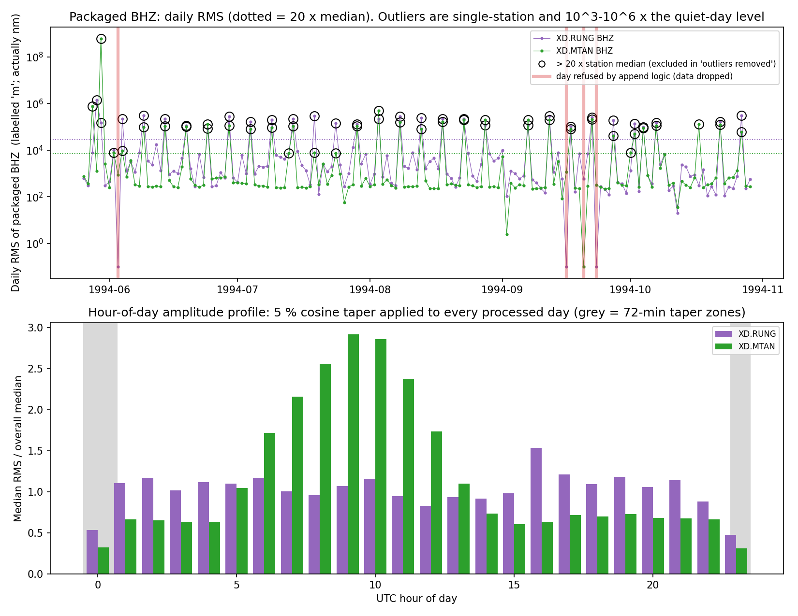
*Figure 4 — Daily RMS of the packaged BHZ (dotted = 20× median) and hour-of-day amplitude profile.*

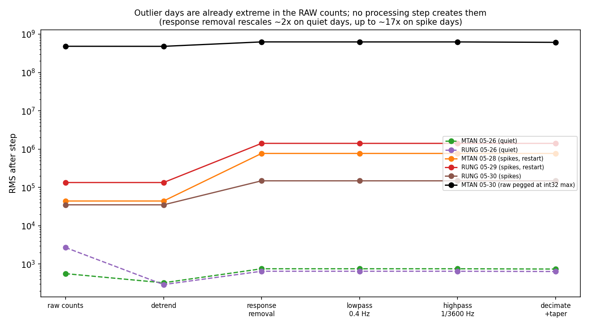
*Figure 5 — RMS after each processing step for quiet and outlier days.*

### 4.4 Unit label (conditional on the station's metadata)
Both StationXML files declare the response input as **NM/S** (`evidence/units_refusals_survey.txt`). ObsPy's `remove_response(output="DISP")` then returns nanometres, but the orchestrator labels the data `units="m"`. Quiet-day RMS ≈ 352–1444 is ≈ 1 µm — a normal microseism level — confirming nanometres, a factor 10⁹ off the label.
This is **not universal**: in the 6 other stations whose metadata was readable in the earlier quick-test directory, all declare M/S. It is a property of older-vintage metadata; the pipeline should detect it rather than assume.

### 4.5 5 % taper on both ends of every day (universal)
`tr.taper(max_percentage=0.05)` runs on each processed day — 5 % (72 min) at *both* ends of every UTC day. Hours 0 and 23 carry 0.47 (RUNG) and 0.35 (MTAN) of the mid-day amplitude. The zero-phase 1 h high-pass also leaves edge transients of the same order, so the correct fix is overlap-padded processing (recommended, not patched here — §5).

### 4.6 Hard-coded window and channels (universal by design)
The orchestrator fixes the window to 1970–yesterday and the channels to `BH?,LH?` (LH preferred). The request specified BH only. IRIS station metadata (queried 2026-09-25, `evidence/iris_channel_metadata.txt`) lists **LH? channels for both stations over the whole window**, so the premise that no LH exists does not hold for the metadata; whether LH waveform data exist was not tested. BH had complete coverage (477 files per station, all 159 days). If LH data exist, the tool's own preference order would select native 1 Hz data, which avoid the decimation-phase mechanism of §4.1.

## 5. The fixes (patched copies in `patches/`, diffs in `patches/*.diff`)

Nothing in the authors' source tree was edited: the patched files are copies, the diffs apply to `add-september-ncf-pipeline` as it stood on 2026-09-25. Defaults are unchanged (new behaviour is either non-destructive or opt-in through environment variables).

| id | file | change | why | benefit (measured) |
|---|---|---|---|---|
| 1 | `build_master_h5.py` (new `align_to_integer_second`) + call in `orchestrator.py` | after decimation, shift each processed day (band-limited fractional delay) so sample 0 sits exactly on an integer UTC second | removes the k×0.05 s placement error of §4.1 | measured shift between original and fixed data equals the replay's prediction to a median of 0.0 ms (§4.1); benchmark in §6 |
| 1b | `build_master_h5.py::append_channel_data` | trim ≤ 2 coinciding leading samples of the new data instead of refusing the day; skip data already stored; still refuse larger overlaps | §4.2 | the 4 hard cases all pass; **0 refused days** on the full window (original: 4) |
| 2 | `orchestrator.py` | a refused day is not marked done and is counted (`n_days_refused`, `day_errors`); benign skips go to `day_notes` | a silently lost day | failure is visible in the result file |
| 3 | `orchestrator.py` | per-day raw-quality sidecar `<shard>.qc.json` (RMS / robust σ, int32 saturation, record segments, flag) — flags only, nothing removed | §4.3 | flags MTAN 05-28 (ratio 102.6, 2 segments) and no quiet day in the 4-day test (`evidence/fixed_test_verification.txt`); over the window BHZ is flagged on 30 (MTAN) and 52 (RUNG) of 159 days — mostly the 5-day periodic events of §4.3 — and RUNG BHN on 115 (a persistently heavy-tailed component, §4.3). Any channel: MTAN: 32 days, RUNG: 117 days |
| 4 | `orchestrator.py` | derive the output unit from the response input units; rescale NM/S→m; label unrecognised units instead of calling them "m" | §4.4 | quiet-day RMS ≈ 7×10⁻⁷ m; ratio to the old label exactly 10⁹ |
| 6 | `orchestrator.py` | `WAVENET_START/END/CHANNELS/CHANNEL_PRIORITIES/SKIP_DOWNLOAD/DAY_START/DAY_END/TAPER_PCT` | §4.6 (and reprocessing without re-download, date-range parallelism) | the fixed full run used exactly these |
| — | (not patched) taper | needs overlap-padded per-day processing | §4.5 | recommendation |

**Line-level map** (generated from the diff; `patches/hunks.md`):

| file | original lines | patched lines | patch id | added / removed |
|---|---|---|---|---|
| `orchestrator.py` | 41-41 | 41 | 1 | +1 / -1 |
| `orchestrator.py` | 52-53 | 52-97 | 3, 4, 6 | +46 / -2 |
| `orchestrator.py` | 138-138 | 182 | 6 | +1 / -1 |
| `orchestrator.py` | 141-141 | 185 | 6 | +1 / -1 |
| `orchestrator.py` | 149-149 | 193 | 6 | +1 / -1 |
| `orchestrator.py` | 151-151 | 195 | 6 | +1 / -1 |
| `orchestrator.py` | 193 | 238 | 2 | +1 / -0 |
| `orchestrator.py` | 194 | 240 | 1b/2 | +1 / -0 |
| `orchestrator.py` | 219 | 266-279 | 3, 6 | +14 / -0 |
| `orchestrator.py` | 236 | 297-299 | 3 | +3 / -0 |
| `orchestrator.py` | 239 | 303 | 3 | +1 / -0 |
| `orchestrator.py` | 240 | 305 | 3 | +1 / -0 |
| `orchestrator.py` | 243 | 309 | 4 | +1 / -0 |
| `orchestrator.py` | 249 | 316-318 | 4 | +3 / -0 |
| `orchestrator.py` | 261 | 331 | 1 | +1 / -0 |
| `orchestrator.py` | 263-264 | 333-336 | 3, 4, 6 | +4 / -2 |
| `orchestrator.py` | 275 | 348 | 2 | +1 / -0 |
| `orchestrator.py` | 286-286 | 359 | 4 | +1 / -1 |
| `orchestrator.py` | 289-289 | 362 | 4 | +1 / -1 |
| `orchestrator.py` | 291 | 365-367 | 1b/2 | +3 / -0 |
| `orchestrator.py` | 296 | 373 | 2 | +1 / -0 |
| `orchestrator.py` | 300 | 378-382 | 2 | +5 / -0 |
| `orchestrator.py` | 316-316 | 398-400 | 2, 3 | +3 / -1 |
| `build_master_h5.py` | 24 | 25-48 | 1 | +24 / -0 |
| `build_master_h5.py` | 26-26 | 50 | 1b | +1 / -1 |
| `build_master_h5.py` | 69-71 | 93-106 | 1b | +14 / -3 |
| `build_master_h5.py` | 97-97 | 132-133 | 1b | +2 / -1 |

Patch ids: **1** = integer-second alignment; **1b** = overlap trim / skip; **2** = refused days not marked done + counted; **3** = per-day raw-quality sidecar; **4** = response-derived unit label + scaling; **6** = env-configurable window/channels/day range/taper.


**Verification.** (a) `tests/test_patches.py`: 6 unit tests, all pass on the patched file; the original `append_channel_data` reproduces both bugs in isolation (refuses the day after an 86,401-sample day; places a +0.700 s error). (b) A 4-day end-to-end test including the partial first day, and 4 hard cases (a day before each of the four originally fully-refused days, plus that day), all with 0 refusals. The fifth case (RUNG 1994-10-20, BHE/BHN) was not a separate test; it is covered by the full-window run:

```
=== result JSONs ===
fixed_test/0000_XD_MTAN.json {'package_ok': True, 'n_days_processed': 4, 'n_days_refused': 0, 'n_days_qc_flagged': 1, 'day_errors': None, 'day_notes': {}}
fixed_test/0001_XD_RUNG.json {'package_ok': True, 'n_days_processed': 4, 'n_days_refused': 0, 'n_days_qc_flagged': 1, 'day_errors': None, 'day_notes': {}}
fixed_test2_mtan_0919/0000_XD_MTAN.json {'package_ok': True, 'n_days_processed': 3, 'n_days_refused': 0, 'n_days_qc_flagged': 0, 'day_errors': None, 'day_notes': {}}
fixed_test2_rung_0602/0001_XD_RUNG.json {'package_ok': True, 'n_days_processed': 3, 'n_days_refused': 0, 'n_days_qc_flagged': 3, 'day_errors': None, 'day_notes': {}}
fixed_test2_rung_0915/0001_XD_RUNG.json {'package_ok': True, 'n_days_processed': 3, 'n_days_refused': 0, 'n_days_qc_flagged': 3, 'day_errors': None, 'day_notes': {}}
fixed_test2_rung_0922/0001_XD_RUNG.json {'package_ok': True, 'n_days_processed': 3, 'n_days_refused': 0, 'n_days_qc_flagged': 3, 'day_errors': None, 'day_notes': {}}
=== verify (fixed_test vs original) ===

===== XD.MTAN =====
channels: ['BHE', 'BHN', 'BHZ']
BHZ fixed: n=282,248  start_time=1994-05-25T17:35:52.000000Z  integer second: True  units='m'  sr=1.0
  QC 19940525: BHZ: flag=False rms/robust=4.2 sat=False segs=1
  QC 19940526: BHZ: flag=False rms/robust=1.2 sat=False segs=1
  QC 19940527: BHZ: flag=False rms/robust=1.0 sat=False segs=1
  QC 19940528: BHZ: flag=True rms/robust=102.6 sat=False segs=2
  1994-05-26: RMS orig = 743 nm-labelled-m ; RMS fixed = 7.43e-07 m  (ratio 1e+09)
      measured shift between orig-slice and fixed-slice = +0.022 s   (replay predicted +0.022 s; band coherence 1.000)
  1994-05-27: RMS orig = 375 nm-labelled-m ; RMS fixed = 3.75e-07 m  (ratio 1e+09)
      measured shift between orig-slice and fixed-slice = +0.020 s   (replay predicted +0.020 s; band coherence 1.000)

===== XD.RUNG =====
channels: ['BHE', 'BHN', 'BHZ']
BHZ fixed: n=311,623  start_time=1994-05-25T09:26:17.000000Z  integer second: True  units='m'  sr=1.0
  QC 19940525: BHZ: flag=False rms/robust=23.6 sat=False segs=1
  QC 19940526: BHZ: flag=False rms/robust=9.3 sat=False segs=1
  QC 19940527: BHZ: flag=False rms/robust=12.0 sat=False segs=1
  QC 19940528: BHZ: flag=False rms/robust=15.4 sat=False segs=1
  1994-05-26: RMS orig = 640 nm-labelled-m ; RMS fixed = 6.4e-07 m  (ratio 1e+09)
      measured shift between orig-slice and fixed-slice = -0.999 s   (replay predicted -0.999 s; band coherence 0.988)
  1994-05-27: RMS orig = 301 nm-labelled-m ; RMS fixed = 3.01e-07 m  (ratio 1e+09)
… (complete listing: evidence/fixed_test_verification.txt)
```

(c) Full-window run of the fixed pipeline: days processed MTAN 159, RUNG 159, refused **0**, units `m`; start times are integer seconds (1994-05-25T17:35:52, 1994-05-25T09:26:17).

## 6. FastMSPEC correlation and ADAMA benchmark

| variant | days | correlation with ADAMA-predicted coherence | ADAMA zero crossings found | observed crossings that are real | median velocity offset vs ADAMA | 95th percentile of absolute coherence |
|---|---|---|---|---|---|---|
| Original pipeline, as packaged (the smoke test proper) | 156 | +0.65 | 8/12 | 0.67 | -2.3 % | 0.17 |
| Original, outlier days removed | 121 | +0.69 | 8/12 | 0.67 | -2.5 % | 0.24 |
| Original + downstream timing correction | 153 | +0.83 | 12/12 | 1.00 | -0.5 % | 0.18 |
| Original + timing correction + outlier days removed | 118 | +0.88 | 12/12 | 1.00 | -0.7 % | 0.24 |
| FIXED pipeline, as packaged | 157 | +0.83 | 12/12 | 1.00 | -0.6 % | 0.17 |
| FIXED pipeline, outlier days removed | 122 | +0.88 | 12/12 | 1.00 | -0.7 % | 0.24 |
| Single-taper, original pipeline | all | +0.69 | 10/12 | 0.80 | -1.7 % | 0.19 |
| Single-taper, fixed pipeline | all | +0.87 | 12/12 | 1.00 | -0.2 % | 0.19 |


*Figure 6 — Correlation overlay: real part of the coherence (single-taper grey; FastMspec original red, timing-corrected blue, FIXED pipeline cyan dashed) against the Bessel coherence J0(2π f R / c) from the ADAMA Rayleigh phase velocity (black dashed). Vertical lines: ADAMA-predicted zero crossings.*

In the fixed pipeline's coherence the zero crossings coincide with the ADAMA prediction throughout the band without any downstream correction, and the amplitude is within about a factor of two of the prediction above 0.09 Hz; the original drifts out of phase. Below about 0.06 Hz all variants, fixed or not, stay well below the predicted amplitude (about 0.06 observed against 0.30 predicted near 0.04 Hz); this is common to every variant, so it is not a pipeline symptom, and its cause was not investigated here.

**Picking with the seislib-derived picker (kernel density estimate, KDE, view).** The picker was run on every coherence with two reference curves: a flat 3.5 km/s prior with a ±0.8 km/s corridor (independent of ADAMA — the fair test) and ADAMA's own curve (circular; shown because it is how the batch pipeline is configured).
Top of each figure: the coherence with low-quality crossings in red; bottom: the KDE field, reference (light blue), tracked branches, picks and the final smoothed curve.

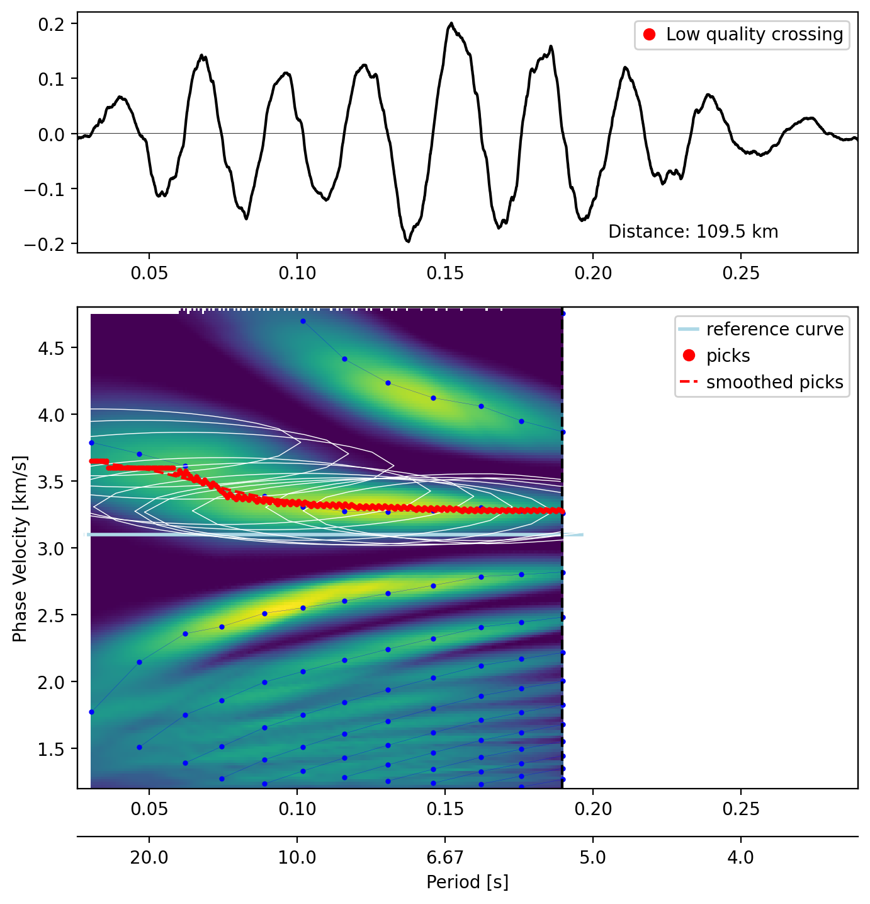
*Figure 7 — Picker KDE view — FIXED pipeline, ADAMA-independent reference.*

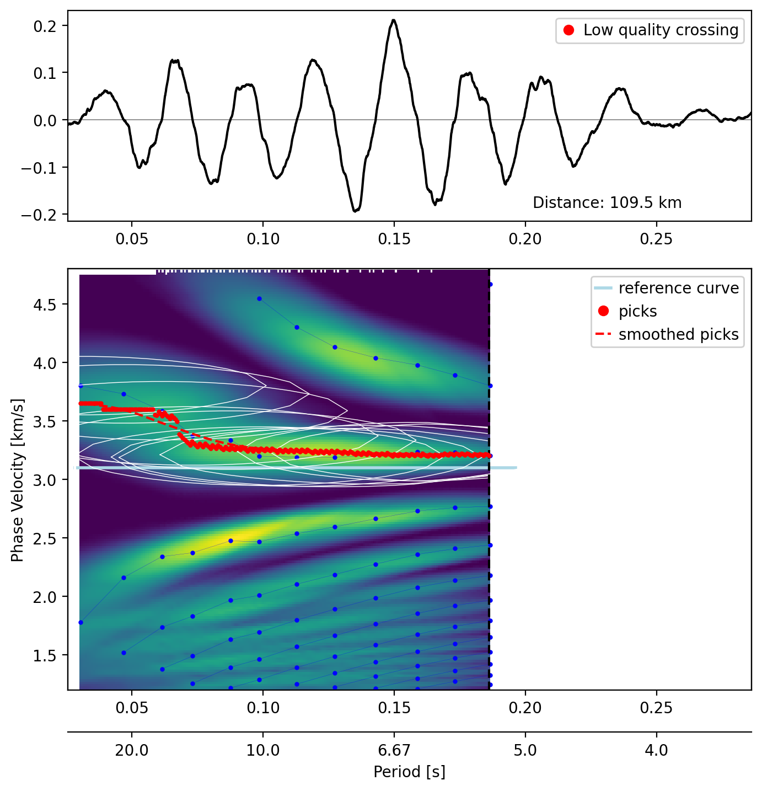
*Figure 8 — Picker KDE view — original pipeline as packaged, same reference.*

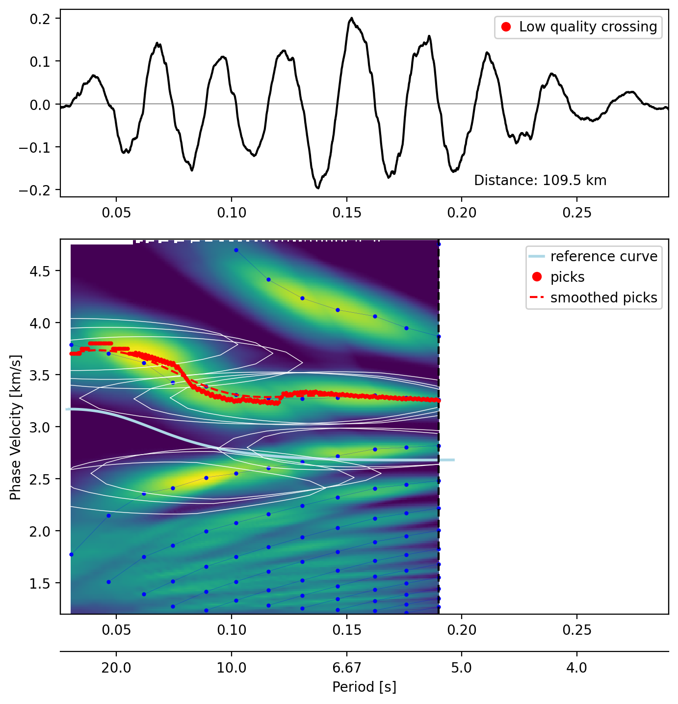
*Figure 9 — Picker KDE view — FIXED pipeline, reference = ADAMA curve (circular).*

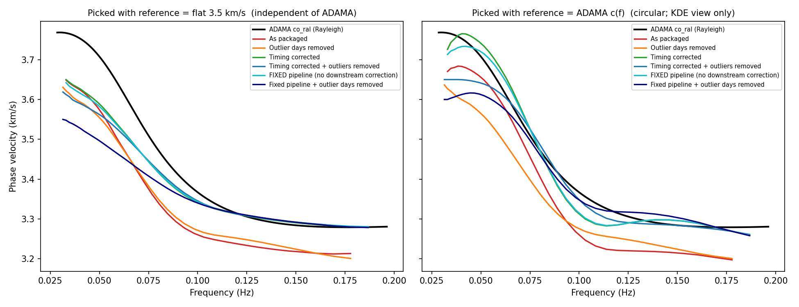
*Figure 10 — Picked curves versus ADAMA.*

| picker reference curve | coherence used | converged | frequency coverage | picked band (Hz) | mean offset vs ADAMA | root-mean-square offset |
|---|---|---|---|---|---|---|
| flat 3.5 km/s | original, as packaged | yes | 0.95 | 0.033-0.178 | -3.1 % | 3.2 % |
| flat 3.5 km/s | original, outliers removed | yes | 0.95 | 0.031-0.178 | -3.2 % | 3.4 % |
| flat 3.5 km/s | original + timing correction | yes | 0.95 | 0.033-0.187 | -1.6 % | 2.2 % |
| flat 3.5 km/s | original + timing corr. + outliers removed | yes | 0.95 | 0.031-0.187 | -2.0 % | 2.6 % |
| flat 3.5 km/s | FIXED pipeline | yes | 0.95 | 0.033-0.187 | -1.7 % | 2.3 % |
| flat 3.5 km/s | fixed pipeline, outliers removed | yes | 0.95 | 0.031-0.187 | -2.9 % | 3.8 % |
| flat 3.5 km/s | single-taper (original) | **no** |  |  |  |  |
| ADAMA c(f) | original, as packaged | yes | 0.95 | 0.033-0.178 | -2.1 % | 2.2 % |
| ADAMA c(f) | original, outliers removed | yes | 0.95 | 0.031-0.178 | -3.0 % | 3.1 % |
| ADAMA c(f) | original + timing correction | yes | 0.95 | 0.033-0.187 | -0.0 % | 0.9 % |
| ADAMA c(f) | original + timing corr. + outliers removed | yes | 0.95 | 0.031-0.187 | -0.9 % | 1.5 % |
| ADAMA c(f) | FIXED pipeline | yes | 0.95 | 0.033-0.187 | -0.2 % | 0.8 % |
| ADAMA c(f) | fixed pipeline, outliers removed | yes | 0.95 | 0.031-0.187 | -1.3 % | 2.1 % |
| ADAMA c(f) | single-taper (original) | **no** |  |  |  |  |

The single-taper coherence never yields a pickable curve with either reference.

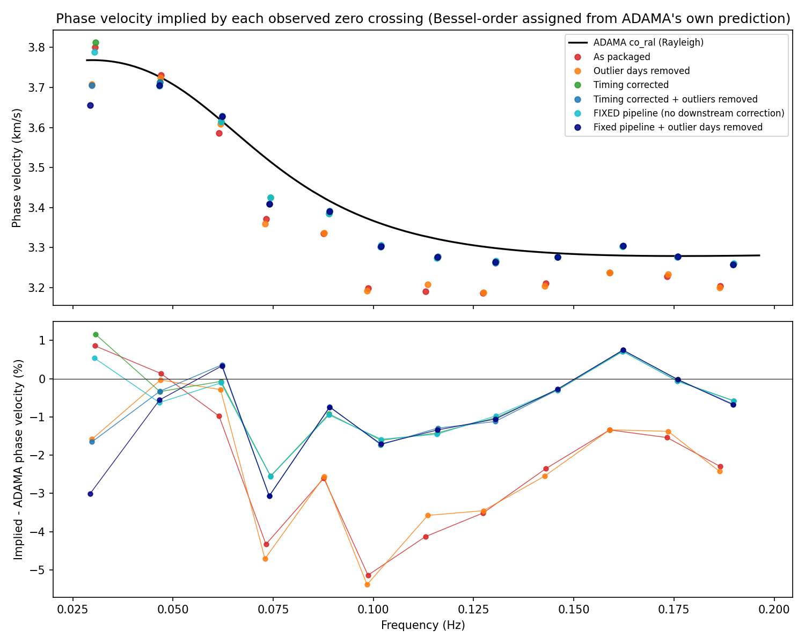
*Figure 11 — Phase velocity implied by each observed zero crossing versus ADAMA (Bessel order assigned from the ADAMA prediction).*

**Time-domain check.** Inverse-transforming the FastMspec coherency (0.03–0.2 Hz) gives a noise cross-correlation function (NCF) with a Rayleigh-wave arrival near ±35 s for 109.5 km. A timing offset between the stations shifts both peaks the same way, so the peak asymmetry is a direct read-out of it:

| variant | causal peak lag | acausal peak lag | asymmetry (0 = symmetric) | implied group velocity |
|---|---|---|---|---|
| Original pipeline, as packaged (the smoke test proper) | +34.23 s | -35.31 s | -1.08 s | 3.20 / 3.10 km/s |
| Original, outlier days removed | +26.51 s | -35.34 s | -8.83 s | 4.13 / 3.10 km/s |
| Original + downstream timing correction | +35.14 s | -34.47 s | +0.67 s | 3.12 / 3.18 km/s |
| Original + timing correction + outlier days removed | +27.44 s | -34.47 s | -7.04 s | 3.99 / 3.18 km/s |
| FIXED pipeline, as packaged | +35.12 s | -34.46 s | +0.66 s | 3.12 / 3.18 km/s |

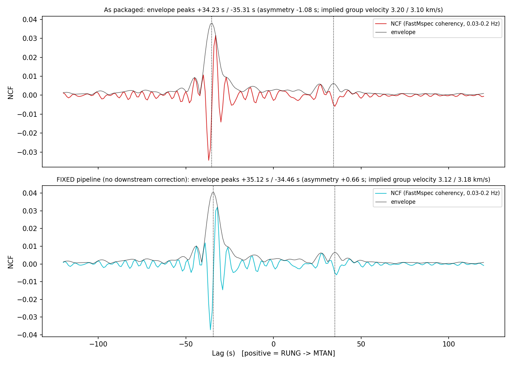
*Figure 12 — NCF for the original and fixed data.*

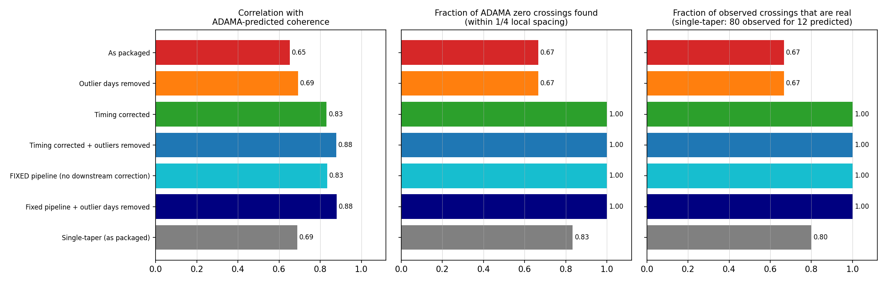
*Figure 13 — Scorecard across variants.*

## 7. What this benchmark does and does not validate
Coherence depends on the *relative* phase and timing of the two records at each frequency. It validates download and stitching, decimation and filtering, polarity, sample-rate handling, merging, the reader, and (through the corrected and fixed variants) where the timing defect is. It cannot see errors common to both stations —
the unit scale, the amplitude taper, a shared response error (both are the same sensor type) — or anything outside 0.03–0.2 Hz; those were checked by direct inspection (§4.4–4.5). ADAMA's curve is independent but an *initial* (`co`) solution, not ground truth; the flat-reference picks are the fair accuracy test.

## 8. Is this specific to this pair? Implications
| finding | universal? | reason |
|---|---|---|
| day-placement timing error (§4.1) | **mechanism universal, size station-specific** | every station's grid is anchored to a mid-day first sample at an arbitrary sub-second phase; error = k×0.05 s, k uniform over 0…19 for 20 Hz data. For a random pair: RMS offset **0.41 s**, > 0.25 s for **54 %** of pairs, > 0.5 s for **23 %**. Native 1 Hz (LH) channels should be spared (no decimation phase) — expected from the mechanism, not tested here. Matches both stations here (k = 4 → +0.20 s, k = 14 → +0.70 s). |
| dropped days (§4.2) | universal logic, data-dependent rate | any day whose data run past midnight (an extra end sample, or a record straddling midnight); here 5 of 318 station-days (4 lost on all channels, 1 on two) |
| 5 % taper (§4.5) | universal, deterministic | hard-coded for every day of every station |
| unit label (§4.4) | conditional | depends on the input units in each StationXML; 6 of 6 other readable stations were M/S |
| corrupt raw days (§4.3) | universal in kind, specific in which days | every archive has some; here mostly a 5-day periodic event at both stations (§4.3), plus recorder restarts and one saturated day; earthquake days also trip a heavy-tail flag, so the flag means "suspect", not "bad" |
| hard-coded parameters (§4.6) | universal by design | |

**Implications at scale.** (i) The timing error is random per pair and does not average out: it biases phase-based measurements (zero crossings, phase velocity, lag), most at short periods and short distances — here it accounted for most of a 2.3 % velocity bias and turned a full match into a partial one. (ii) Data can be dropped silently: 5 of 318 station-days here; the rate elsewhere depends on how often day files run past midnight, which the timing audit on a station sample would measure. (iii) NM/S-declared stations would be mis-scaled by 10⁹ in any amplitude use. (iv) Corrupt days enter stacks unflagged. (v) A machine-learning stage trained on these correlations would inherit the timing bias. The sample here is one pair; the mechanism argument and the exact enumeration above are what generalise it, and `code/timing_replay.py` can audit any other station from its raw headers.

## 9. Reproduction (for an evaluating agent)
1. Read `PATCHES.md`, then apply `patches/all.diff` (or copy `patches/patched_files/*`) onto `add-september-ncf-pipeline`.
2. `pytest tests/test_patches.py` (set `BUILD_MASTER_DIR` to test another copy). The tests fail on the unpatched functions by design.
3. Audit a station's timing from raw headers: `code/timing_replay.py` (edit the station list/paths); compare with a measured shift as in `code/verify_all_days.py`.
4. Bluehive job files and every script used are in `code/`; small outputs in `results/`; raw evidence in `evidence/`; all figures in `figures/`. To regenerate the figures (`code/make_report_figures.py`) and the report (`code/render_report.py`, then `code/md_to_pdf.py`) from `results/`, point `FASTMSPEC_DIR` at a checkout of `github.com/URseismology/FastMSPEC` (branch `notebook5-phase-velocity-revamp`), which supplies the picker.
