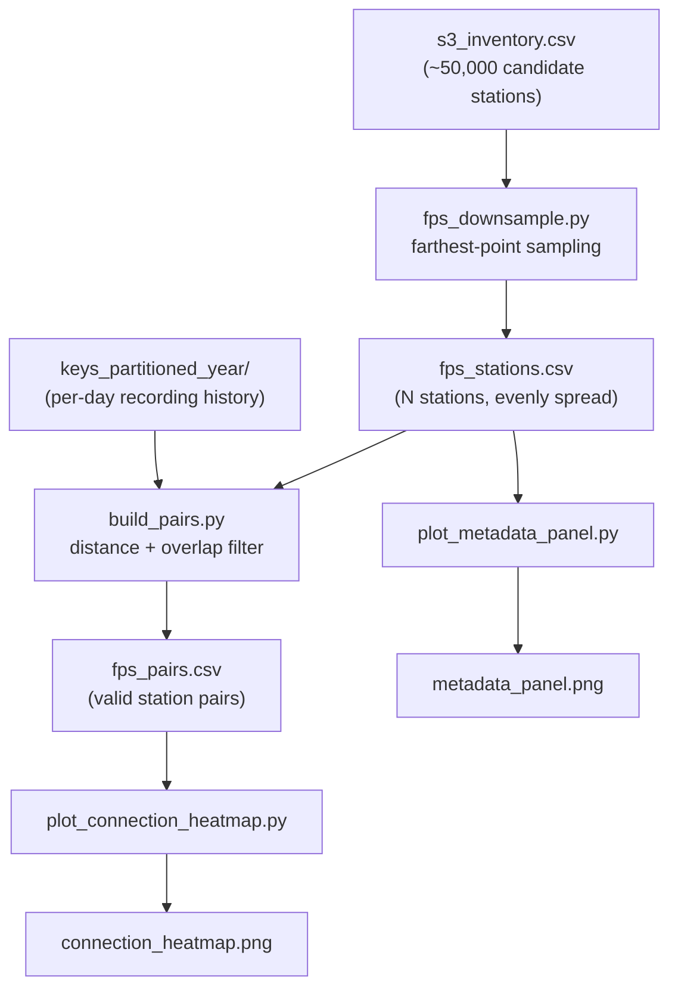
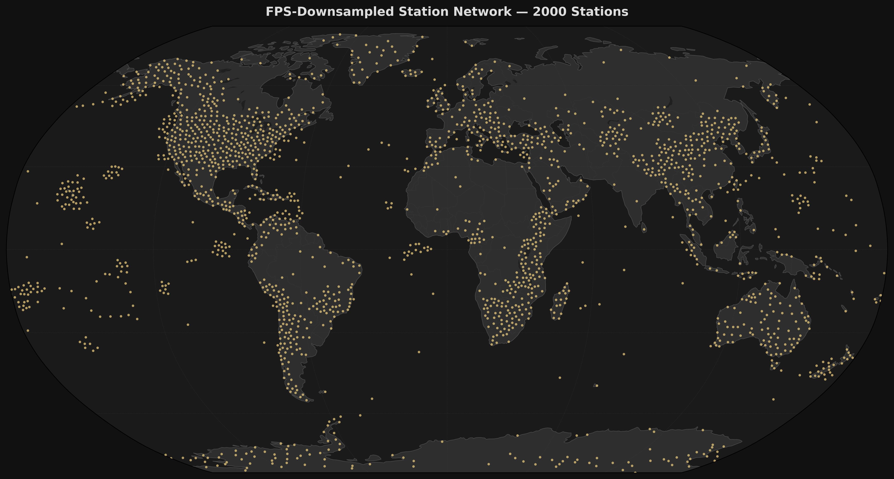
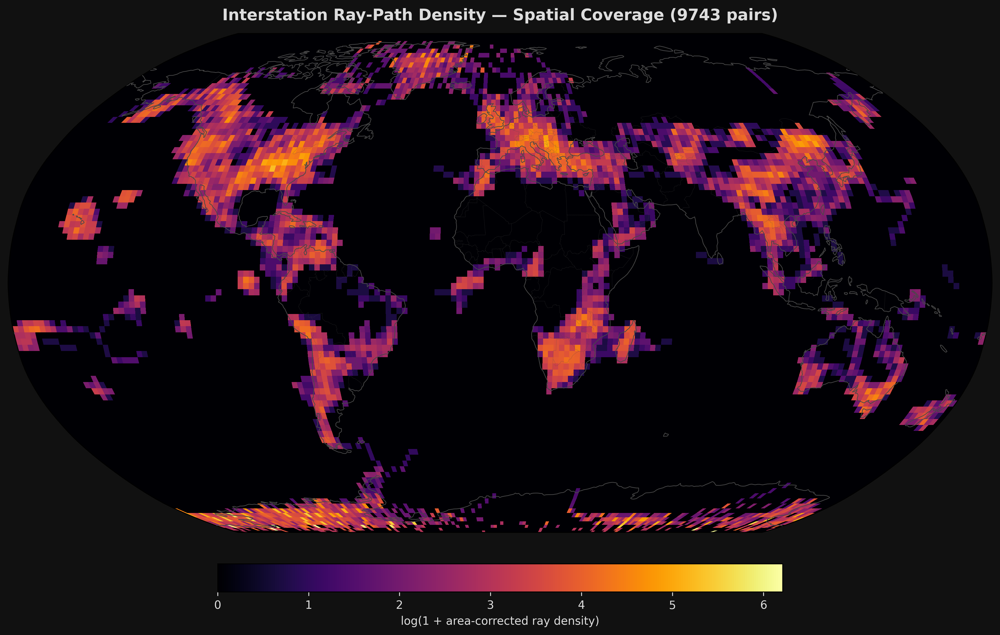

# metadata3 — FPS Station Network Pipeline

Builds a spatially even, cross-correlation-valid network of seismic stations from the full
EarthScope S3 station inventory, and produces two figures to inspect the result.

**Staged, PI-reviewable progress tracking for this whole acquisition pipeline (this
folder through preprocessing/packaging/cross-correlation) lives at
[docs/ncf_pipeline_stages/PROGRESS.md](../../../../docs/ncf_pipeline_stages/PROGRESS.md)** —
this folder's own output is Stage 0 there. See that doc set before starting new work here.

## What this does, in one picture



Four scripts, run in order:

1. **`fps_downsample.py`** picks a manageable, evenly-spread subset of stations out of the
   full ~50,000-station inventory.
2. **`build_pairs.py`** connects those stations into pairs, keeping only pairs that are
   physically valid for cross-correlation.
3. **`plot_metadata_panel.py`** draws the selected stations on a world map.
4. **`plot_connection_heatmap.py`** draws a heatmap of how densely those pairs cover the
   globe, so gaps in spatial coverage are easy to spot.

---

## 1. Picking the stations — `fps_downsample.py`

The full inventory has stations clustered wherever deployments happened to be dense (e.g.
ocean-bottom seismometer arrays) and sparse elsewhere. Using all of them isn't necessary or
scalable, but naively picking a random subset would keep the same clumps and gaps.

Instead, this script uses **farthest-point sampling (FPS)**: start with the station that has
the most recorded days, then repeatedly add whichever remaining station is farthest from
every station already picked. The result spreads out evenly across the globe with no
leftover clumping — every region, including sparse ones like open ocean or Africa, gets fair
representation.

`fps_downsample.py` is purely spatial: it has no notion of *when* a station recorded, only
*where* it is. Recording-time overlap between stations is handled entirely downstream by
`build_pairs.py`. Keeping selection and pairing separate means a station is never skipped
just because it doesn't (yet) have a temporally-compatible neighbor — it still adds coverage,
and can gain valid pairs later as the network grows.

```bash
python fps_downsample.py --n-stations 2000 --min-days 15
```

- `--min-days` drops stations with too little recorded data to be useful (default 15 days).
- `--n-stations` sets how many stations to keep (default 1500; current run uses 2000).
- Picks are saved in the order they were chosen (`rank` column). This means a larger run
  (e.g. `--n-stations 5000`) starts with the exact same first 2000 stations as this run —
  growing the network later never requires redoing this step.

**Output — `fps_stations.csv`:** `rank, network, station, lat, lon, days`

### Result: 2,000 stations, evenly spread



Every dot is a selected station. Notice there's no favoritism toward already-dense regions —
North America and Europe aren't over-represented just because more stations exist there.

---

## 2. Connecting the stations — `build_pairs.py`

Not every pair of stations is useful for cross-correlation. Two stations that are too close
together don't give a clean signal; two that are too far apart pick up ambiguous, unreliable
signals. Two stations also need enough *overlapping* recording time to build a usable signal
together — a pair that was never recording on the same days at all is useless no matter how
well-placed it is.

This script keeps a pair only if **both** of the following are true:

| Check | Requirement |
|---|---|
| Distance between the two stations | 110–1,110 km (roughly what 1–10 degrees of great-circle separation averages out to, at ~111 km/degree) |
| Days both stations were recording at the same time | ≥ 90 days (under 1,500 km apart) or ≥ 365 days (over 1,500 km apart) — longer paths need more data to produce a clean signal |

Since the distance band currently tops out at 1,110 km, every pair falls under the 1,500 km
tier split, so the 365-day tier is presently dormant. It's left in place for when
`--sep-max-km` is raised for a wider run.

```bash
python build_pairs.py --sep-min-km 110 --sep-max-km 1110
```

**Output — `fps_pairs.csv`:** `net1, sta1, lat1, lon1, net2, sta2, lat2, lon2, distance_km, shared_days`

At the current 2,000-station scale: **40,170 pairs** fall within the 110–1,110 km distance
band, and **9,743** survive the shared-days gate (24.3% pass rate). The source inventory spans
1969–2026 and mixes stations from many incompatible deployment eras, so most geometrically
valid pairs never actually recorded at the same time — this is an expected property of the
data, not a bug. Since pair count grows faster than station count (a denser network shrinks
average interstation spacing, pulling more pairs into the legal band), `--n-stations` is the
lever to pull for more pairs, without touching station selection or the distance/overlap
gates and without sacrificing spatial coverage anywhere.

---

## 3. Checking spatial coverage — `plot_connection_heatmap.py`

Having a lot of pairs doesn't automatically mean good global coverage — they could all be
clustered in one region. This script draws every pair's path on the globe and counts how many
paths cross each area, producing a heatmap: bright = many crossing paths, dark = few or none.

```bash
python plot_connection_heatmap.py --grid-deg 2.0
```

### Result: where the network's coverage is strong vs. weak



Bright bands over continents show where the network connects well. Dark areas (open ocean,
polar regions) are places no pair currently crosses — useful to know if the network needs
filling in later.

---

## Requirements

The two data files below are needed but are too large to store in this repo — generate them
once, then reuse them for every run:

| File | How to get it |
|---|---|
| `s3_inventory.csv` | Run `s3_inventory.ipynb` (Google Colab) |
| `keys_partitioned_year/` | Run `python build_key_index.py --outdir keys_partitioned_year` (GeoLab) |

Python packages: `pandas`, `numpy`, `scikit-learn`, `pyarrow`, `pyproj`, `matplotlib`, `cartopy`.

## Scaling up

To grow the network later, just rerun step 1 with a bigger number and redo steps 2–4:

```bash
python fps_downsample.py --n-stations 5000
python build_pairs.py
python plot_metadata_panel.py
python plot_connection_heatmap.py
```
